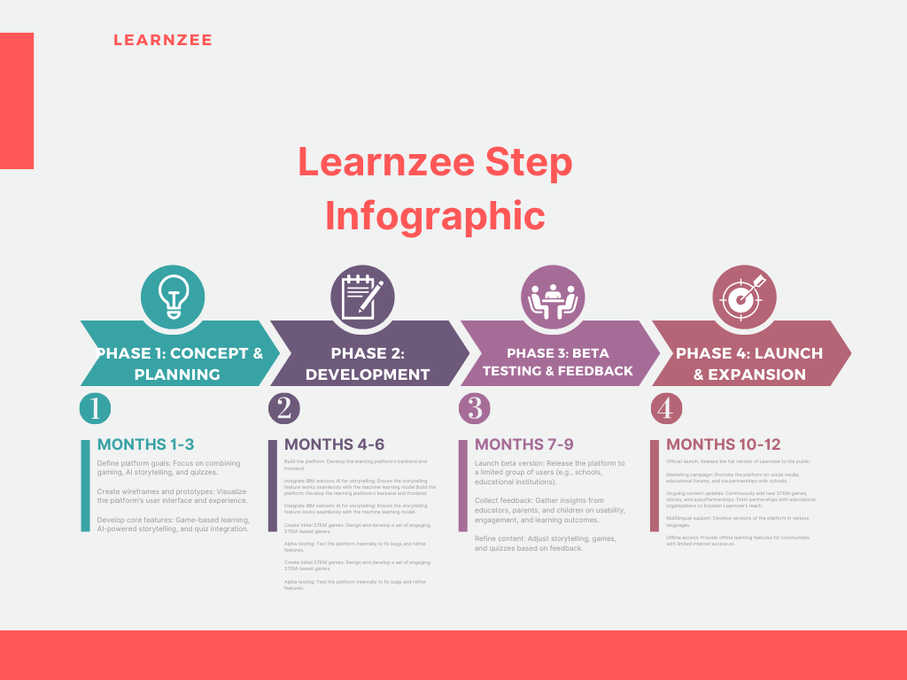

# Learnzee

_Read this in other languages: [English](README.md), [한국어](./docs/README.ko.md), [português](./docs/README.pt_br.md), [中文](./docs/README.zh.md)._

## Contents

- [learnzee](#learnzee)
  - [Contents](#contents)
  - [Short description.](#short-description)
    - [What's the problem?](#whats-the-problem)
    - [How can technology help?](#how-can-technology-help)
    - [The idea](#the-idea)
  - [Demo video](#demo-video)
  - [The architecture](#the-architecture)
  - [Long description](#long-description)
    - [learnzee](#learnzee-1)
    - [DID YOU KNOW?](#did-you-know)
    - [The Problem](#the-problem)
    - [SOLUTION](#solution)
    - [Conclusion](#conclusion)
  - [Project roadmap](#project-roadmap) - [learnzee currently does the following:](#learnzee-currently-does-the-following)
    - [it currently runs on IBM Cloud Foundary.](#it-currently-runs-on-ibm-cloud-foundary)
    - [See below for our proposed schedule on next steps after Call for Code 2024 submission.](#see-below-for-our-proposed-schedule-on-next-steps-after-call-for-code-2024-submission)
  - [Live demo](#live-demo)
  - [Built with](#built-with)
    - [Online](#online)

## Short description.

Learnzee is an innovative online learning platform designed for kids, offering immersive educational experiences through gaming. It provides access to equitable educational tools and STEM-focused games that enhance learning outside the classroom. A unique feature of Learnzee is its story generator, powered by the IBM watsonx Machine Learning API, which creates engaging stories that teach moral lessons. Each story is accompanied by quizzes, helping children reinforce the lessons learned in a fun and interactive way.

### What's the problem?

- Many children struggle to stay engaged with traditional learning methods, particularly when it comes to STEM subjects, which are critical for future career success. This disengagement can lead to lower retention of knowledge and a lack of interest in vital areas of education.

- Access to quality education and learning resources remains a significant issue, especially for children from underprivileged backgrounds. Not all children have access to the tools needed for effective learning, further widening the education gap.

- Moral education, which helps shape children’s understanding of values such as honesty, integrity, and kindness, is often underrepresented in traditional curricula, leaving a gap in their development of character and ethical decision-making.

- Children often lack structured learning opportunities outside the classroom, which hinders continuous development. Without engaging platforms to reinforce what they learn in school, children may struggle to keep up, especially when learning becomes less structured at home.

### How can technology help?

Technology can transform the way children learn by making education more engaging, accessible, and inclusive. Through immersive gaming, interactive storytelling, and AI-driven tools, children can stay engaged in learning in ways that are tailored to their needs and interests. 

With platforms like Learnzee, technology can help:
- Provide fun, game-based learning experiences that make subjects like STEM more engaging and improve knowledge retention.
- Ensure that children from disadvantaged or underprivileged backgrounds have access to equitable educational tools, breaking down economic barriers and giving them a fair chance at success.
- Reinforce moral values through engaging, interactive storytelling, helping children learn essential life lessons in a way that resonates with them.
- Bridge the gap between school and home by offering resources and tools that encourage outside-classroom learning, ensuring continuous education and growth.

### The idea

Learnzee is an online learning platform designed to make education fun and immersive for kids. It uses gaming to teach children in an engaging way, making STEM subjects more accessible and exciting. Powered by the IBM watsonx Machine Learning API, Learnzee features a story generator that creates imaginative stories with moral lessons, helping kids develop not only academically but also in terms of character.

By offering equitable educational tools, STEM games, and interactive quizzes, Learnzee ensures that children—regardless of background—can continue learning outside the classroom. Its focus on storytelling and game-based learning makes it an inclusive and dynamic solution to modern educational challenges.

## Demo video

[Watch the video](https://www.youtube.com/watch?v=hI54VopbpZI)

## The architecture

[Video transcription/translation app](https://github.com/CaptRaven/learnzee/blob/)

1. The user navigates to the site
2. the platform is hosted on vercel

## Long description

### LEARNZEE

### DID YOU KNOW?

According to UNICEF Even though primary education is officially free and compulsory, about 10.5 million of the country’s children aged 5-14 years are not in school ?!
The education deprivation in northern Nigeria is driven by various factors, including economic barriers, socio-cultural norms and practices that discourage attendance in formal education, especially for girls.

[learnzee website](https://call-for-code-learnzee.vercel.app/)

### The Problem

Many children struggle to stay engaged with traditional learning methods, particularly when it comes to STEM subjects, which are critical for future career success. This disengagement can lead to lower retention of knowledge and a lack of interest in vital areas of education.

Access to quality education and learning resources remains a significant issue, especially for children from underprivileged backgrounds. Not all children have access to the tools needed for effective learning, further widening the education gap.

Moral education, which helps shape children’s understanding of values such as honesty, integrity, and kindness, is often underrepresented in traditional curricula, leaving a gap in their development of character and ethical decision-making.

Children often lack structured learning opportunities outside the classroom, which hinders continuous development. Without engaging platforms to reinforce what they learn in school, children may struggle to keep up, especially when learning becomes less structured at home.

### SOLUTION

Learnzee is an online learning platform designed to make education fun and immersive for kids. It uses gaming to teach children in an engaging way, making STEM subjects more accessible and exciting. Powered by the IBM watsonx Machine Learning API, Learnzee features a story generator that creates imaginative stories with moral lessons, helping kids develop not only academically but also in terms of character.

By offering equitable educational tools, STEM games, and interactive quizzes, Learnzee ensures that children—regardless of background—can continue learning outside the classroom. Its focus on storytelling and game-based learning makes it an inclusive and dynamic solution to modern educational challenges.

### Conclusion

OUR SOLUTION LEARNZEE that provides an online learning resources and a more immersive learning platform for kids using gaming to teach children and have access to equitable educational tools and STEM games to enhance outside classroom learning and also an AI story telling powered by IBM WATSONX MACHINE LEARNING API.

<!-- [More detail is available here](./docs/DESCRIPTION.md) -->

## Project roadmap

##### Learnzee currently does the following:

- online learning resources
- immersive learning platform for kids using gaming to teach children,
  the games include:
  - 4 Pics One Word
  - Memory Boxes
  - Math And Climate
- to enhance child learning experience
- An AI story telling feature, Powered by IBM WATSONX MACHINE LEARNING API

#### it currently runs on Vercel.

#### See below for our proposed schedule on next steps after Call for Code 2024 submission.

## Live demo

You can find a running system to test at [call-for-code-learnzee.vercel.app](https://call-for-code-learnzee.vercel.app).

## Built with
- [RESTAPI]NodeJs - Javascript
- [FASTAPI](https://fastapi.tiangolo.com/) - Python Web API used
- [Text-To-Speech](https://developer.mozilla.org/en-US/docs/Web/API/Web_Speech_API/Using_the_Web_Speech_API) - API used for text to speech
- [Speech-Recognition](https://developer.mozilla.org/en-US/docs/Web/API/Web_Speech_API/Using_the_Web_Speech_API) - API used for speech recognition
- [React JS](https://reactjs.org) - JavaScript Library for user interface